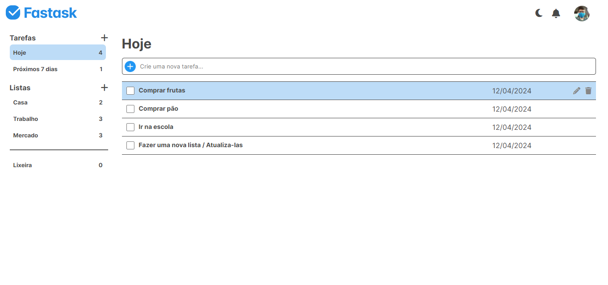

# [Fastask - Gerenciador de tarefas](https://paulo-mikhael.github.io/fastask)

[](https://paulo-mikhael.github.io/fastask)

## Sobre ✏️
  ### A Fastask é uma aplicação web que busca facilitar a gestão de tarefas, a página possui um design limpo e intuitivo, seu funcionamento consiste principalmente em criar, excluir e editar tarefas, elas podem ser separadas por categorias, e as tarefas deletadas ficam armazenadas em seu campo respectivo para o usuário fazer o que bem entender com elas.

## Tecnologias 💻


## Rodando Localmente (Prompt) 📟
### Clone o projeto
```bash
  git clone https://github.com/Paulo-Mikhael/fastask
```
### Entre no diretório do projeto
```bash
  cd fastask
```
### Acesse o arquivo index.hmtl
```bash
  start index.html
```

## Talvez você queira ver 💡
  ### [Portifólio](https://portifolio-react-three.vercel.app/)
  ### [Currículo](https://docs.google.com/document/d/1xhimUtV6EM7c1GtwBwAHsIonX1HjoLSi/edit)

## Confira meus outros projetos 🛠️
  - [PHLOX Blog - Blog de uma empresa de tecnologia](https://github.com/Paulo-Mikhael/phlox-blog?tab=readme-ov-file#readme)
  - [in.orbit (back-end) - API de metas](https://github.com/Paulo-Mikhael/in-orbit-backend?tab=readme-ov-file#readme)
  - [Nutri+ - Dashboard Nutricional](https://github.com/Paulo-Mikhael/nutri-plus-dashboard?tab=readme-ov-file#readme)
  - [in.orbit (front-end) - Aplicação de metas pessoais](https://github.com/Paulo-Mikhael/in-orbit-frontend?tab=readme-ov-file#readme)
  - [Landing Page para uma academia](https://github.com/Paulo-Mikhael/academia-landing-page?tab=readme-ov-file#readme)
  - [Landing Page para um e-commerce de plantas](https://github.com/Paulo-Mikhael/casa-verde?tab=readme-ov-file#readme)

## Contatos 📞
  [](https://portifolio-react-three.vercel.app/contacts)
  [](https://www.linkedin.com/in/paulo-miguel-4b706022b/)
  [](https://www.instagram.com/pa__miguel?igsh=MWxoYzdqNGluZWcyaA%3D%3D)
  [](https://api.whatsapp.com/send/?phone=5592992813253&text=Ol%C3%A1%21+Gostaria+de+fazer+uma+oferta...&type=phone_number&app_absent=0)
